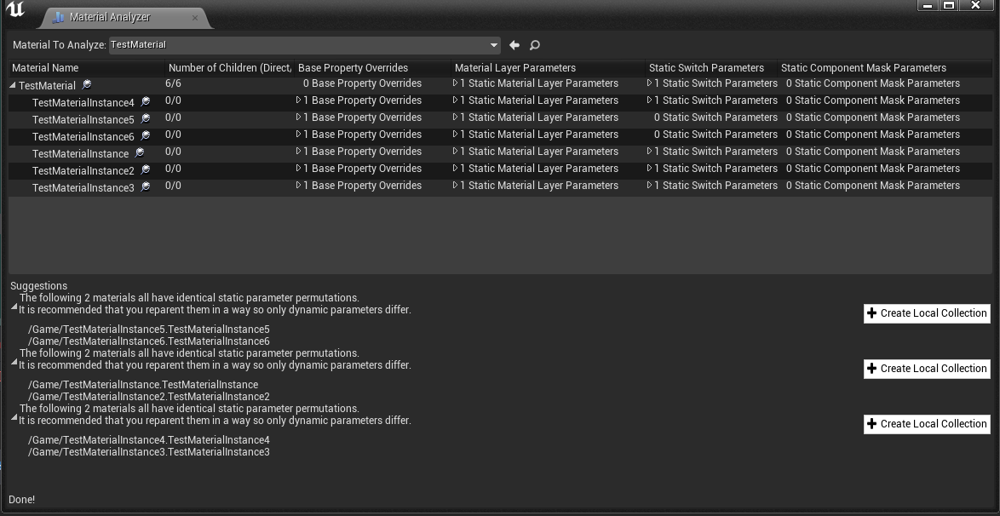
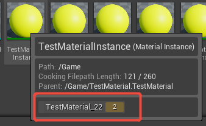
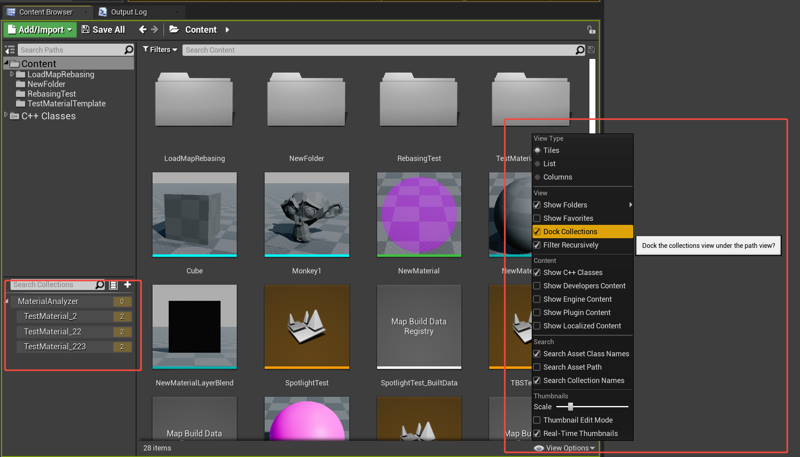

# Material-Analyzer

Material-Analyzer is a variant analysis tool in Unreal Engine that can obtain details such as Property Override, Material Layer, and Static Switch of materials.

Resources with identical details can be combined into a single Collection by clicking the "Create Local Collection" button.

Assets added to a collection will be displayed in AssetToolTip.

You can toggle the ContentBrowser switch to display the Collection's search box.

