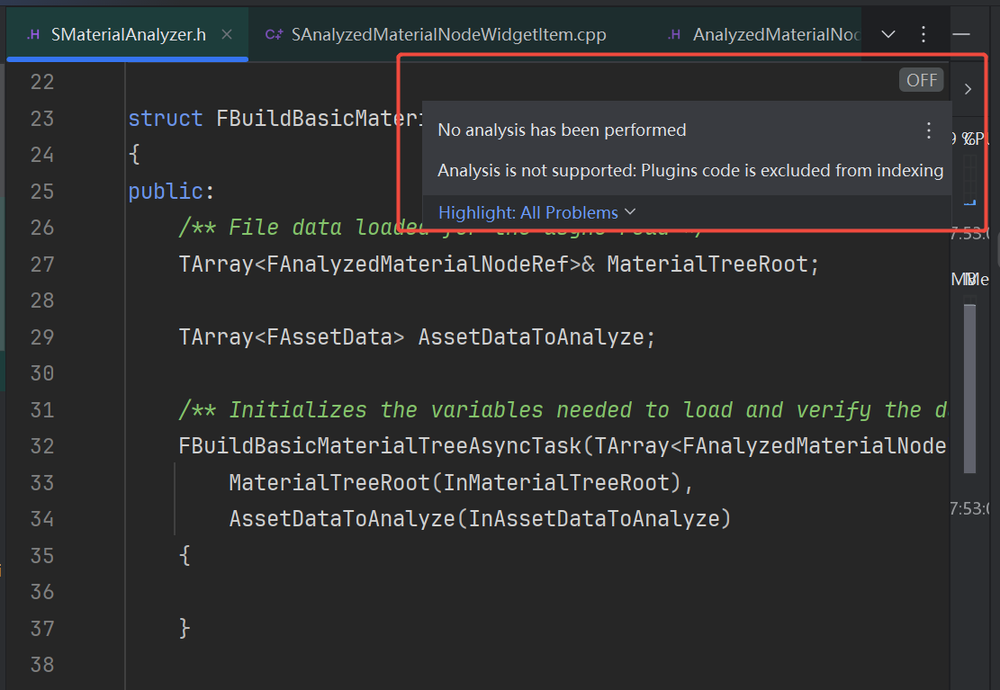
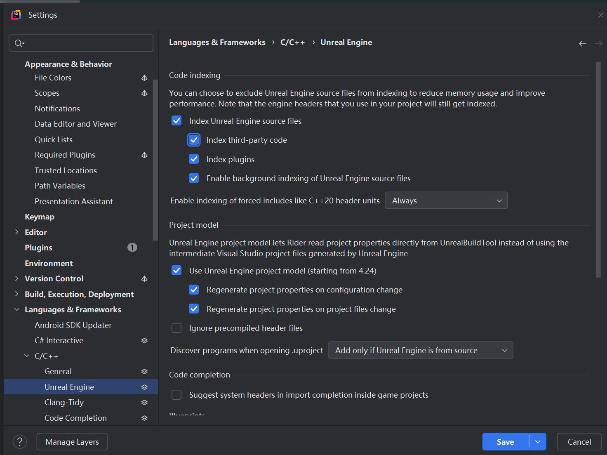
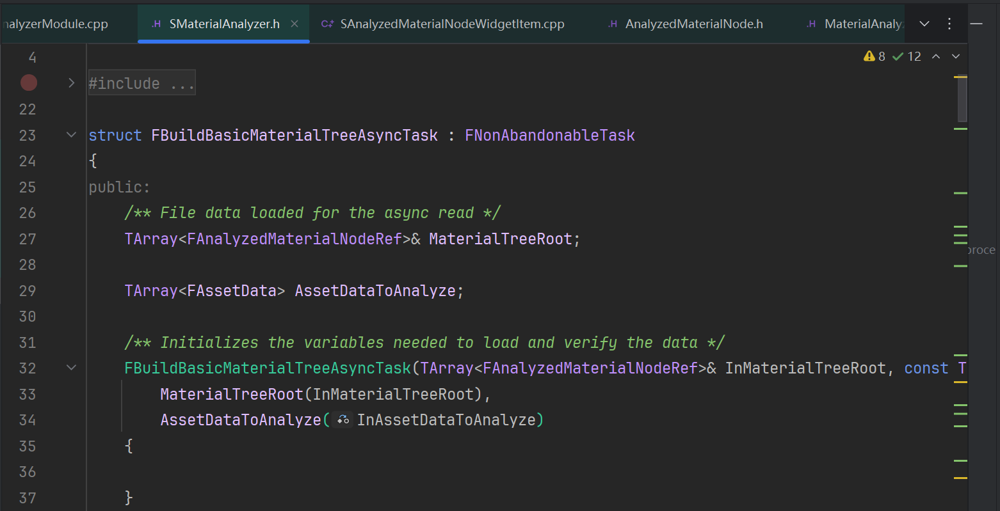

# Rider Code Analysis

When CodeAnalysis is not executed, the code cannot perform the right-click search definition and usage.

Go to File | Settings | Languages & Frameworks | C/C++ | Unreal Engine, check Index Plugins, and restart.

Then you can see the code has been highlight.

